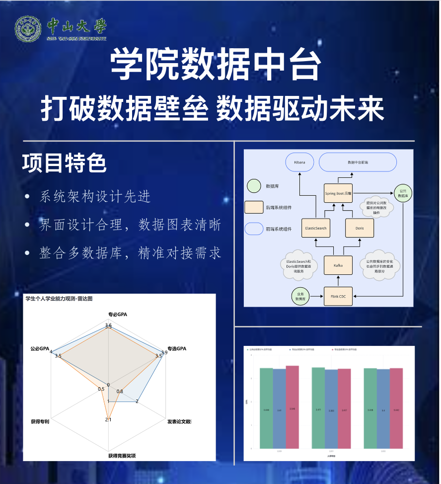

# 学院数据中台

中山大学软件工程学院

## 项目简介

为了满足不断扩张的学院规模下愈加繁多的学院内部系统的开发需要，针对学院内部系统数据库需求，开发出学院数据中台。该系统能够作为学院存储中心、分析中心角色。学院其他系统将不再需要自建数据库，仅通过链接到数 据中台完成数据库操作。数据中台可减少多系统间的冗余数据，加快开发进度，同时，数据中台将具备数据挖掘能力，以可视化形式提供数据筛选、聚合分析等功能。

为了满足上述需求，我们基于前端 vue 框架+后端 Java+Springboot 框架 +FlinkCDC 数据同步+ElasticSearch 全文查找+Doris 数据仓库等技术。完成了学院数据中台的开发，圆满完成了各项需求。

## 功能介绍

### 操纵统一数据库

为中台管理员提供了友好的前端界面，支持数据表内容以及表结构的增删改操作，用户可以灵活管理数据表和数据内容，提升数据管理的便捷性和高效性。

### 业务系统管理员权限管理

业务系统管理员权限管理部份包括对业务系统管理员的设定，权限修改等增删改查操作。权限的赋予使用mysql内置的权限管理实现。

### 数据查询

提供简洁易用的查询界面，支持多种条件的查询和筛选，包括精确查询、模糊查询以及范围查询，帮助用户快速检索和获取所需数据。

### 数据可视化

通过核心数据监控展板，将选择的数据字段自动生成多种类型的图表，如雷达图、柱状图和饼状图等，直观展示数据的各个维度，方便用户理解和分析数据。

## 项目作者

- 陈钧韬（组长）：负责整体协调和监督项目进展，引导团队成员进行深入的讨论与交流。负责数据筛选、操纵数据库、设置管理员权限的后端开发。
- 黄梓铭、黄鹏程：负责数据查询、数据可视化部分的后端开发。
- 陈怡帆：负责数据查询、数据筛选、操纵数据库、设置管理员权限部分的前端开发。
- 何明昊：负责数据可视化的前端开发。

## 海报

